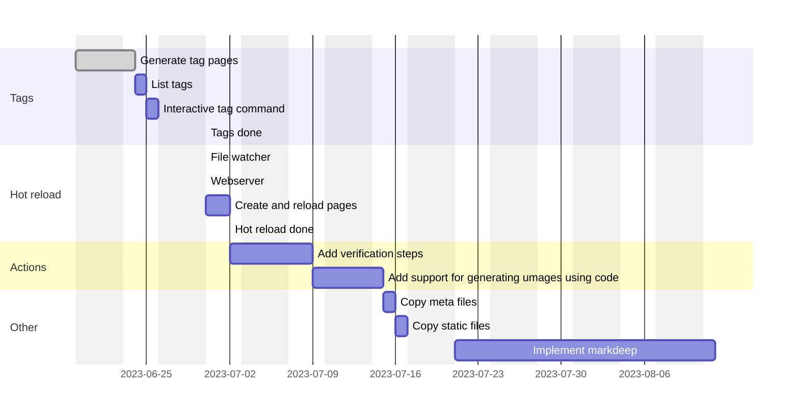

# blag-gen
A simple static page generator

https://xkcd.com/148/

https://www.explainxkcd.com/wiki/index.php/148:_Mispronouncing

# usp
* Frontmatter looks like markdown so pure markdown previews won't look bad
* Custom template engine inspired by mustache and hugo templates.

# todo

Perhaps there is some order in this list but it's mostly so I can remember what features I think are missing and I want to add

* Support having a different dist folder layout than the source layout
* Tags
  - generate tag pages
  - command to list tags to use
  - interactive command to add tags to existing posts?
* Watch mode/Hot-reload
  - File watcher/Generate files when saved
  - Create a webserver
  - Reload pages when generated
* Copy meta-files such as images
* Copy static files
* Implement markdeep
* Add verification steps to make sure code samples can be compiled and (unit) tested
  - compile code "without errors"
  - use some sort of shebang to annotate what code pieces are used
  - merge several code pieces to a single executable
  - use patterns to create executable (generate cmake files for example)
  - test and run and check against code output in another code sample or special comments in the original sample
* Add support for generating images using code
  - for example using processing
  - custom code that outputs images or svg

# A rough plan
This isn't really plan, just a rough sketch to figure out when the goals might be completed...

